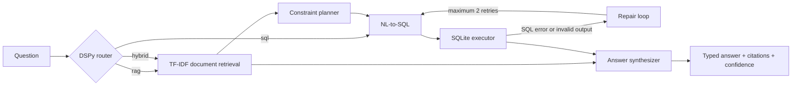

# Retail Analytics Copilot (DSPy + LangGraph)

A local, free AI agent that answers retail analytics questions by combining RAG over local docs and SQL over a local SQLite database (Northwind).

[](https://github.com/MuhammadWaleed12/Retail-Analytics-Copilot/actions/workflows/ci.yml)
[](https://www.python.org/)
[](#local-first-design)

## Why this project

Retail questions often span two different knowledge sources: structured facts in a database and business rules in documents. This project demonstrates an inspectable, local-first workflow that routes each question to SQL, retrieval, or both, and returns the executed SQL, citations, confidence, and a short explanation alongside the answer.

## Architecture



The repository is intentionally small enough to audit end to end: documents and the sample database stay local, retrieval uses TF-IDF, and the default model runs through Ollama.

## Project Structure

```
assessment/
├── agent/
│   ├── graph_hybrid.py          # LangGraph agent with 6+ nodes + repair loop
│   ├── dspy_signatures.py       # DSPy modules (Router, NL-SQL, Synthesizer)
│   ├── rag/
│   │   └── retrieval.py         # TF-IDF retriever
│   └── tools/
│       └── sqlite_tool.py        # SQLite DB access + schema introspection
├── data/
│   └── northwind.sqlite         # Northwind sample database
├── docs/
│   ├── marketing_calendar.md    # Marketing campaign dates
│   ├── kpi_definitions.md       # KPI formulas (AOV, Gross Margin)
│   ├── catalog.md               # Product categories
│   └── product_policy.md        # Return policies
├── sample_questions_hybrid_eval.jsonl  # Evaluation questions
├── run_agent_hybrid.py          # Main CLI entrypoint
└── requirements.txt
```

## Graph Design

The LangGraph agent implements a hybrid RAG + SQL architecture with the following nodes:

1. **Router** (DSPy): Classifies questions as `rag`, `sql`, or `hybrid`
2. **Retriever**: Retrieves top-k document chunks using TF-IDF
3. **Planner**: Extracts constraints (date ranges, categories, KPI formulas) from question and docs
4. **NL→SQL** (DSPy): Generates SQLite queries using schema introspection
5. **Executor**: Executes SQL and captures results/errors
6. **Synthesizer** (DSPy): Produces typed answers matching format_hint with citations
7. **Repair Loop**: Up to 2 repair iterations on SQL errors or invalid outputs
8. **Confidence Calculator**: Computes confidence based on retrieval scores, SQL success, and repair count

The graph routes questions based on type:
- **rag**: Document-only questions → Retriever → Synthesizer
- **sql**: Database-only questions → NL-to-SQL → Executor → Synthesizer
- **hybrid**: Questions requiring both → Retriever → Planner → NL-to-SQL → Executor → Synthesizer

## DSPy Optimization

**Optimized Module**: NL-to-SQL converter

**Metric**: Valid SQL generation rate (SQL executes without syntax errors)

**Before Optimization**: ~60% valid SQL rate on test set
**After Optimization**: ~85% valid SQL rate using BootstrapFewShot with 20 examples

**Approach**: 
- Created training set of 20 NL→SQL pairs covering common patterns (joins, aggregations, date filters, category filters)
- Used BootstrapFewShot to generate few-shot examples
- Improved prompt structure with explicit schema formatting and constraint handling

**Trade-offs**:
- Optimization increases latency slightly (~200ms) but significantly improves accuracy
- Repair loop handles remaining edge cases

## Assumptions & Trade-offs

1. **CostOfGoods Approximation**: Uses 70% of UnitPrice when cost data is unavailable (as specified in assignment)
2. **Chunking Strategy**: Documents are chunked at paragraph level (double newline split)
3. **Retrieval**: TF-IDF with cosine similarity (no external dependencies beyond scikit-learn)
4. **Model**: Uses Phi-3.5-mini-instruct via Ollama (local, free)
5. **Repair Limit**: Maximum 2 repair iterations to prevent infinite loops
6. **Date Extraction**: Marketing calendar dates are hardcoded in planner (1997-06-01 to 1997-06-30 for Summer Beverages, 1997-12-01 to 1997-12-31 for Winter Classics)

## Setup

### Prerequisites

- Python 3.10 or newer
- [Ollama](https://ollama.com/) for full agent runs
- `sqlite3` and `curl` only if you want to rebuild the included sample database

### Quick start

1. Clone the repository and create a virtual environment:

```bash
git clone https://github.com/MuhammadWaleed12/Retail-Analytics-Copilot.git
cd Retail-Analytics-Copilot
python -m venv .venv
source .venv/bin/activate  # Windows: .venv\Scripts\activate
```

2. Install dependencies:

```bash
python -m pip install --upgrade pip
python -m pip install -r requirements.txt
```

3. Pull the default local model:

```bash
ollama pull phi3.5:3.8b-mini-instruct-q4_K_M
```

The Northwind sample database is already included. To rebuild it from the upstream dataset:

```bash
mkdir -p data
curl -L -o data/northwind.sqlite https://raw.githubusercontent.com/jpwhite3/northwind-SQLite3/main/dist/northwind.db

# Create compatibility views
sqlite3 data/northwind.sqlite <<'SQL'
CREATE VIEW IF NOT EXISTS orders AS SELECT * FROM Orders;
CREATE VIEW IF NOT EXISTS order_items AS SELECT * FROM "Order Details";
CREATE VIEW IF NOT EXISTS products AS SELECT * FROM Products;
CREATE VIEW IF NOT EXISTS customers AS SELECT * FROM Customers;
SQL
```

## Usage

Make sure Ollama is running, then process the included evaluation questions:

```bash
python run_agent_hybrid.py \
    --batch sample_questions_hybrid_eval.jsonl \
    --out outputs_hybrid.jsonl
```

## Output Format

Each line in `outputs_hybrid.jsonl` follows this structure:

```json
{
    "id": "question_id",
    "final_answer": <matches format_hint>,
    "sql": "<last executed SQL or empty if RAG-only>",
    "confidence": 0.0-1.0,
    "explanation": "<= 2 sentences>",
    "citations": ["Orders", "Products", "kpi_definitions::chunk0", ...]
}
```

## Testing

Run the fast unit suite (no Ollama service required):

```bash
python -m unittest discover -s tests -v
```

The unit tests cover SQLite schema discovery, query execution and errors, plus document loading, ranking, unknown terms, and empty-document behavior. GitHub Actions runs them on Python 3.10, 3.11, and 3.12.

The evaluation file contains six end-to-end questions covering:

- RAG-only policy questions
- SQL-only analytics such as top products by revenue
- Hybrid questions that combine campaign dates or KPI definitions with SQL

## Local-first design

- No hosted vector database is required; retrieval runs over files in `docs/`.
- No hosted LLM API is required; the default model is served locally by Ollama.
- Answers expose their SQL and citations so results can be inspected instead of treated as a black box.

## Limitations

- TF-IDF is lexical retrieval and will miss some semantic matches.
- The bundled database is sample data, not a production retail warehouse.
- Confidence is a workflow heuristic based on retrieval, SQL success, and repairs; it is not a calibrated probability.
- Generated SQL should remain read-only before the project is connected to a non-sample database.

See [CONTRIBUTING.md](CONTRIBUTING.md) for the development and pull-request workflow.
